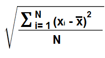
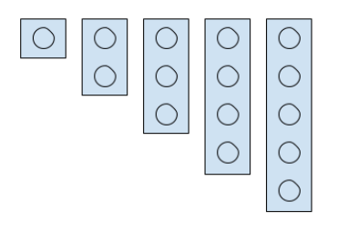

# Enunciados ejercicios Python volumen II

## Consejos

 * No hace falta que compruebes que los datos que se proporcionan en los casos de prueba son correctos. Si se indica que se pasa un entero, se pasará un entero. Si se indica que será mayor o menor que algo, lo será.

* Puedes probar los casos de prueba redireccionando la entrada estándar 

> ```
>  python3 nombredelprograma.py < ficherocasodeprueba
> ``` 

* Tienes casos de prueba dentro de la carpeta _pruebas/test_cases_. Los resultados correctos de cada caso de prueba están en la carpeta _pruebas/result_.

## 001 Buscando sitio 

_Nivel_ [sin definir]

### Especificaciones

La empresa YQEA, dedicada al almacenaje de muebles de decoración tiene un problema en la gestión del almacen. 

El almacen está compuesto de _P_ pasillos, en cada pasillo hay _E_ estanterías y en cada estantería _B_ baldas con _C_ compartimentos. Cada compartimento tiene _H_ huecos, de los cuales hay ya _O_ ocupados (_O_ <= _H_)

El problema surge porque hay ciertos artículos que tienen que ir juntos en la misma balda, por lo que es necesario encontrar una balda en la que puedan caber.

Tu trabajo consiste en crear un programa que, a partir de los datos de ocupación del almacen y del número de artículos que deben ir juntos, indique por cada pasillo, estanteria y balda cuantos huecos quedan y si es posible poner en él los artículos.

**Entrada**

- N: Número de artículos que tienen que ir en la misma balda N<20
- P: Número de pasillos P<10

Por cada pasillo
- E: Número de estanterías E<20

Por cada estantería
- B: Número de baldas B<20

Por cada balda
- C: Número de compartimentos C<20

Por cada compartimento
- C lineas con los huecos ocupados en cada compartimento y el número total de huecos, separados por un espacio.

**Salida**

Por cada balda el número de huecos disponibles y su disponibilidad para colocar los articulos en el formato siguiente:

P pp E ee B bbb hhh XX

donde:
  - _pp_ es el número del pasillo donde está la balda
  - _ee_ es el número de estanteria donde está la balda
  - _hhh_ es el número de huecos totales disponibles
  - _XX_ SI en el caso de que los artículos se puedan colocar, NO en caso contrario

### Ejemplos

<br>

> **Entrada**

5\
1\
1\
2\
3\
2 10\
3 10\
10 10\
2\
8 8\
4 7

> **Salida**

P 00 E 00 B 000 015 SI\
P 00 E 00 B 001 003 NO\


<hr>

## 002 Transportando paquetes

_Nivel_ [sin definir]

La nueva idea de la jefa de almacen de YQEA es la mejora del robot que coloca los artículos de manera automática en las estanterias. El robot que tiene hace un viaje para la colocación o retirada de cada pieza y buscan uno que sea capaz de realizar ese trabajo pero con varios artículos.

El robot saldrá de su base con 0 artículos e irá parando en las diferentes estánterias dejando y/o recogiendo artículos. El objetivo es hacer un estudio con varios casos para saber cual es la capacidad mínima de artículos que debería soportar el robot y así poder ajustar mejor la eficiencia de mismo. En cada caso se indica en cada parada cuanto elementos se dejan y cuantos se recogen.

En cada una de las paradas primero se descargan los artículos y luego se recogen.

**Entrada**

- C: Número de casos de prueba 
- N: Número de paradas por cada caso 

Por cada caso
  N líneas con el número de artículos que se dejan en la estantería y el que se recogen.

**Salida**

La capacidad mínima necesaria por parte del robot en ese conjunto de casos.

### Ejemplos

<br>

> **Entrada**

3\
4\
0 5\
2 4\
3 1\
5 0\
5\
0 3\
3 5\
2 1\
1 6\
9 0\
8\
0 5\
1 5\
1 3\
1 3\
5 0\
4 2\
4 2\
4 0

> **Salida**

13

<hr>

## 003 Exigencias de escaparatista 

Los grandes almacenes El Pespunte Thai han contratado a un escaparatista un poco obsesionado por los espacios libres. Quiere que, cada mañana, el número de artículos disponibles en cada estante sea exactamente el mismo.

Para ello han colocado en cada uno de los estantes sensores que proporcionen información sobre el número de artículos existentes y quieren que el ERP recoja esos datos por la noche y devuelva el número de artículos que hay que solicitar al almacén para que sean colocados antes de abrir.

**Entrada**

- E: Número de estantes
- E números de artículos en los estantes

**Salida**

Número de articulos a pedir al almacen

### Ejemplos

<br>

> **Entrada**

5\
0 1 2 3 4

> **Salida**

10

<br>

> **Entrada**

3\
1 3 1

> **Salida**

4

<hr>

## 004 Dispensando medicamentos 

_Nivel_ [sin definir]

Una farmacia ha instalado un robot que dispensa de manera automática los medicamentos que solicitan los clientes. El robot tiene un recorrido circular, de manera que siempre empieza en el mostrador de la farmacia (su estación) y busca, dando vueltas, los medicamentos en los estantes indicados. 

Se quiere saber el tiempo que va a tardar en volver al mostrador con todos los medicamentos, teniendo en cuenta que de estante a estante siempre tarda un segundo.

**Ejemplo**

Si hay 4 estantes y tiene que recoger medicamentos en los estantes 3, 2 y 3, el recorrido será

1 -> 2 -> **3** -> 4 -> 1 -> **2** -> **3** -> 4 -> 1  => 8

**Entrada**

- N: Número de estantes, contando el mostrador
- listado de estantes en los que hay que recoger un medicamento

**Salida**

Tiempo que tarda en realizar todo el recorrido

### Ejemplos

<br>

> **Entrada**

4\
3 2 3

> **Salida**

8

<br>

## 005 Calculando la desviación típica

_Nivel_ [sin definir]

La desviación típica es una medida muy utilizada en estadística que cuantifica cuánto de dispersos están los datos de un conjunto de datos. Cuanto más cercano es el valor a cero indica que hay muchos datos cercanos a la media (son datos cercanos entre sí, poco dispersos), sin embargo, si cuanto más alto es más dispersos están.

Para un conjunto de datos, su fórmula es:



Donde:

*  _n_ es el número de datos del conjunto
*  _x_ la media de esos datos
*  _xi_ cada uno de los datos

Crea un programa que calcule la desviación utlizando programación funcional (usando funciones map, reduce...)

  > Nota. Para poder trabajar con _reduce_ y con _sqrt_, es encesario importar los modulos functools y math.
  > ```
  > import functools, math
  > ```
  

**Entrada**

- listado de valores enteros

**Salida**

Desviación típica con 4 decimales

### Ejemplos

<br>

> **Entrada**

```
2,4,4,4,5,5,7,9
```

> **Salida**

```
2
```

<br>

> **Entrada**

```
5,4,5,5,5,5,5,4,5
```

> **Salida**

```
0.4157
```

## 006 Montando Legos

_Nivel_ [sin definir]

La empresa _Diversiones y Festejos Infantiles_ ha pensado en un nuevo juego que va a poern en marcha cuando hagan eventos por las calles: montar con piezas de Lego la fila más larga posible.

El problema es que los espacios que les suelen asignar para este tipo de juegos no es muy grande y si los niños llegan al límite del recinto y les quedan piezas por poner suelen acabar llorando y claro, no les daría buena imagen.

Para minimizar el problema, el encargado del evento necesita saber cuál puede ser la longitud máxima de la fila que los niños podrían alcanzar si coloca todas las piezas disponibles y así, solicitar más espacio.

Todos las piezas son unidireccionales, y tienen longitudes de 1, 2, 3, 4, y 5 bloques. Las únicas dos condiciones son:

* que todas las piezas de la fila tienen que ir pegadas (no puede haber espacio entre ellas)
* que para que esta no se desmonte, hay que unir las piezas con otra pieza en una fila superior (las piezas de esta fila no tiene porque estar juntas). Una pieza de esta fila superior (una pieza de unión) sólo puede unir dos piezas.



Piezas de 1, 2, 3, 4 y 5 bloques

**Entrada**

- En primer lugar, un número N indicando cuántos casos de prueba habrá. 1 ≤ N ≤ 1000
- Por cada caso de prueba habrá 5 líneas. Cada una de esas líneas constará de:
    Número de piezas de 1 bloque
    Número de piezas de 2 bloques
    Número de piezas de 3 bloques
    Número de piezas de 4 bloques
    Número de piezas de 5 bloques
    De cada una de las piezas podrá haber un máximo de 10000 unidades.

**Salida**

- Longitud máxima posible de la fila inferior de cada caso de prueba

### Ejemplos

<br>

> **Entrada**

```
3
0
1
2
0
0
0
1
1
1
1
3
0
0
1
1
```

> **Salida**

```
6
9
6
```

<br>
